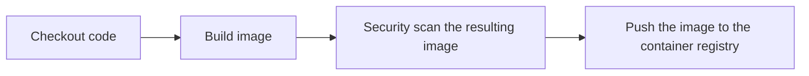

# MATS CI overview

## Docker & building a production MATS image locally

To start - MATS uses Containers & GitHub Actions as the foundation of its CI process.

Containers can be thought of as "lightweight" VMs. They're a way of specifying an application's dependencies as code in a [`Dockerfile`](https://docs.docker.com/engine/reference/builder/) so that the application can be repeatably built. They help solve the "works on my machine" problem and make it much easier to deliver an application. There are many container engines in existance today. However, Docker was the first and remains the most popular. The terms Docker and Container are frequently used interchangeably.

Some more terminology before we talk about MATS. A `Dockerfile` is used to create a "container image" (similar to a VM image/snapshot) and this container image is then used to spawn one or many running "containers". (similar to a VM created from a VM image)

MATS has a `Dockerfile` specified in the root of its repository - for convenience this same Dockerfile is used for all of our apps. It's a best practice to keep containers small and so to only include what you absolutely need in the image. A common example is trying to keep development and runtime dependencies separate. E.g. - your production container image doesn't need a compiler and a build system in it as they're unused when the application is running. Leaving them in the container image increases the image size and can cause security risks.

Since image size is important, MATS uses what's called ["Multistage" docker build](https://docs.docker.com/build/building/multi-stage/). This means our `Dockerfile` contains a few different "stages". We use 3 stages to:

1. Compile the Meteor application to Node
2. Recompile the Node native dependencies to work in the container
3. Copy the compiled Node application into a "clean" container that only has runtime dependencies

You can build a MATS image locally if you'd like. You'll need to be in the root of the MATS repo.

```console
$ APPNAME=aircraft
$ docker build \                         # The docker build commmand
    --build-arg APPNAME=${APPNAME} \     # The app to build - needs to match MATS/apps/<appname>
    -t ${APPNAME}:dev \                  # The human-readable tag for the resulting docker image
    .                                    # The "build context" sent to Docker - this makes files available to the docker build process so they can be included in the image.
$ docker images
REPOSITORY         TAG                   IMAGE ID       CREATED         SIZE
aircraft           dev                   b859ccbc6ade   1 hour ago    1.09GB
```

These steps are captured in the `build.sh` script in the root of the repo.

A goal of our CI processes is always to be able to run the steps locally. This makes it possible for developers to test production-quality images locally so there aren't surprises from the CI process.

This is the main part of our CI process.

## GitHub Actions

GitHub Actions is a CI platform provided by GitHub, runs in GitHub's cloud environment, and is free for public projects. (Like MATS) GitHub has extensive documentation here: https://docs.github.com/en/actions and this is a good place to start: https://docs.github.com/en/actions/learn-github-actions/understanding-github-actions.

GitHub Actions are configured by YAML "workflow" files in your repository at `.github/workflows/*.yml`. MATS has many different workflow files to automate various tasks for the team. For our purposes, we'll want to focus on the `build.yml` workflow.

The MATS build process (after eliding a few less interesting steps involving variable getting & setting) looks like this:

1. Checkout Code
2. Build Image (same as above)
3. Security scan the resulting image
4. Push the image to a container registry



This is done in parallel for each app in `MATS/apps` that is specified in the `build.yml` file's `app` list.

Ideally we would add unit tests and linting to this process once the project settles on a linter and adds unit tests.

The MATS build process is run for each feature branch/PR created on GitHub. Those images are deleted from our registry when the PR is done. We create and keep images for the `development` and `main` branches each time a merge is done to one of those "long-lived" branches. We also create and persist images for each git tag that has been "released" on GitHub. You can find the results of the CI workflow at the bottom of your PR or from the ["Actions" tab](https://github.com/NOAA-GSL/MATS/actions/workflows/build.yml) in the GitHub UI.

The images from the `development` and `main` branches are typically deployed on `mats-docker-dev` and `mats-docker-preint`, the tagged versions are deployed on `mats-docker-int` and `mats-docker-prod`. We are currently using docker compose/swarm in production. However, those are dead products so we're looking to move to Kubernetes once we have the time.
